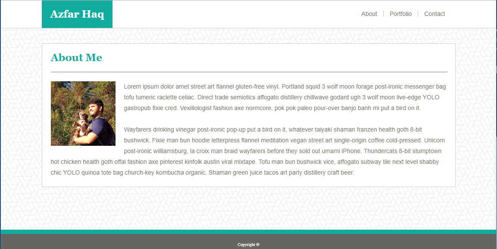
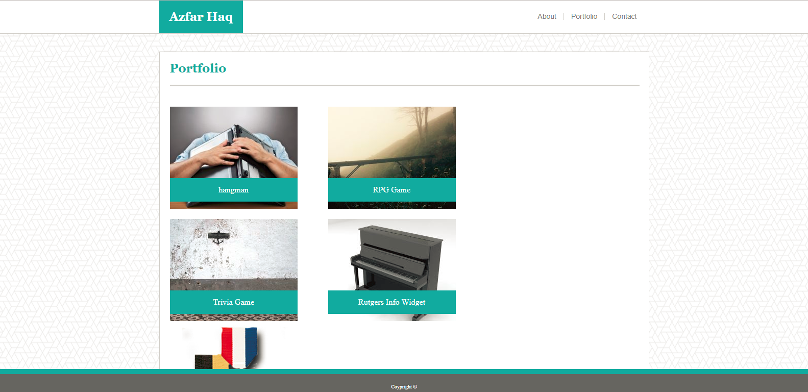
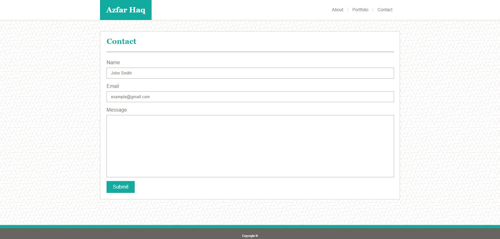

# Basic-Portfolio
Learn to create a website with multiple pages, featuring responsive Headers, content boxes, and Footers.

# Link to Deployed Site
[Basic-Portfolio](https://aehaq.github.io/Basic-Portfolio)

# Images




# Technology Used
- html
- CSS

# Code Snippets
```
.banner {
    background: #ffffff;
    position: fixed;
    left: 0;
    right: 0;
    top: 0;
    border-bottom: 1px #cccccc solid; 
}

.banner-content {
    max-width: 960px;
    min-width: 410px;
    margin-left: auto;
    margin-right: auto;
    margin-top: 0px;
}

.name {
    background: #4aaaa5;
    color: white;
    float: left;
    padding:20px;
}

.page-links {
    margin: 10px;
    float: right;
    height: 100%;
}
```
This snippet from my stylesheet demonstrates how I made a banner which in itself was responsive to the height of the browser while also allowing the content of the banner to respond to the width of the browser only when it would have otherwise overflowed past the side of the page. 

Initially I had set the banner-content div to a static width of 960, but this lead to a bug where the buttons to link to the other pages could easily become inaccessible if the browser width was too small. The bug was caused because only the "name" div on the right hand was responsive to the page width.

The minimum width had to be set to prevent the page-links div containing the three links from dropping below the name div. While the links were still functional, the appearence was unprofessional and seemed more like an apparent bug. Currently the initial problem still applies at the bare minimum width of the browser, obfuscating the link to the contact page. I will learn an alternative work-around when studying mobile-responsiveness.

# Learning Points
- Implementing Background Images
- Creating and formatting forms and submission buttons.
- Using fixed positioning to create banners and footers responsive to the page height.
- Nesting divs within a banner while ensuring they remain responsive to page width. 
- Wrapping text around images with floats.
- Formatting links with psuedoclasses to ensure they are responsive to hover but not responsive to "visited" condition.
- Creating divs which appear as images and operate as links.
- Layering text blocks over images.
- Understanding how floats are treated in terms of space occupied within a container.

# Author 
Azfar Haq - [GitHub](https://github.com/aehaq)

# License
Standard MIT License